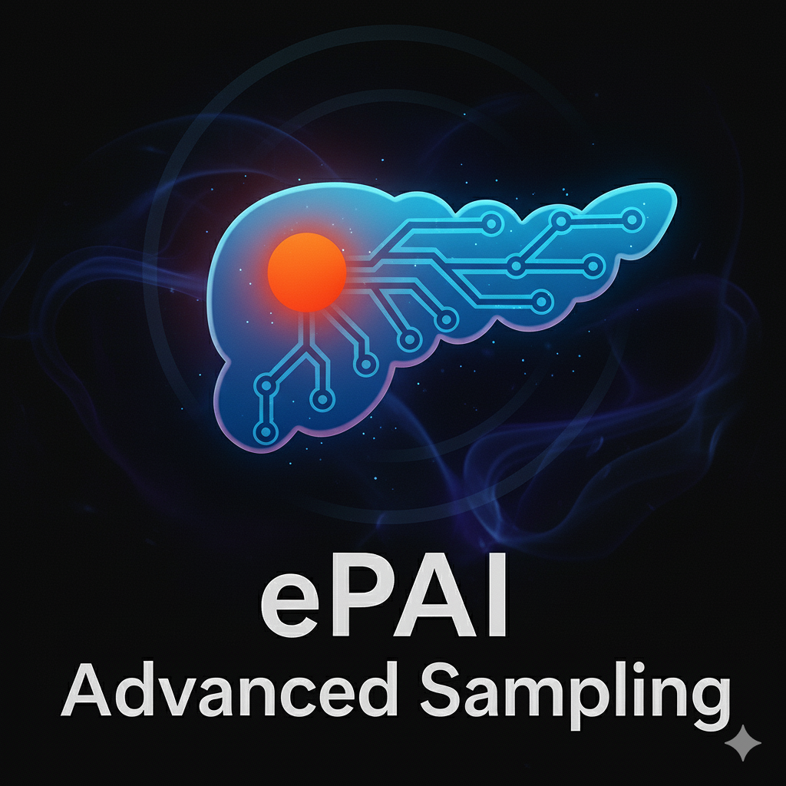

<div align="center">



</div>

---

## 0. Create a virtual environment *[Only for First-Time Users]*

<details>
<summary>[Optional] Install Anaconda on Linux</summary>

```bash
wget https://repo.anaconda.com/archive/Anaconda3-2024.06-1-Linux-x86_64.sh
bash Anaconda3-2024.06-1-Linux-x86_64.sh -b -p ./anaconda3
./anaconda3/bin/conda init
source ~/.bashrc
```
</details>

```bash
# Create the environment
conda create -n ePAI-advanced-sampling python=3.10 -y
```

---

## 1. Installation *[Only for First-Time Users]*

```bash
source activate ePAI-advanced-sampling
# or: conda activate ePAI-advanced-sampling

git clone https://github.com/BodyMaps/ePAI-advanced-sampling.git
cd ePAI-advanced-sampling/train/

pip install --upgrade setuptools packaging
pip install nnunetv2
pip install -e .
pip install --upgrade git+https://github.com/FabianIsensee/hiddenlayer.git
```

<details>
<summary>[Optional] If the above installation does not work for you, try this!</summary>

Delete the current `ePAI-advanced-sampling` environment. Then, do:

```bash
conda create -n ePAI-advanced-sampling python=3.11 -y
source activate ePAI-advanced-sampling
# or: conda activate ePAI

git clone https://github.com/BodyMaps/ePAI.git
cd ePAI/train/

pip install --upgrade setuptools packaging
pip install nnunetv2==2.6.0
pip install -e .
pip install --upgrade git+https://github.com/FabianIsensee/hiddenlayer.git
```
</details>

---

## 2. Train ePAI

### 2.1 Generate JSON file in the path of raw data *[Only for First-Time Users]*

```bash
export nnUNet_N_proc_DA=36 # number of CPU cores
export nnUNet_raw="/mnt/bodymaps/ePAI/nnUNet/raw"
export nnUNet_preprocessed="/mnt/bodymaps/ePAI/nnUNet/preprocessed"

ROOT_PATH="/mnt/T9/project/ePAI/train"
cd $ROOT_PATH

python -W ignore generate_json.py \
  --raw_dir /mnt/bodymaps/ePAI/nnUNet/raw \
  --dataset_name Dataset1013_ePAI_3MM 
# raw_dir: The directory saving raw data
# dataset_name: The folder name in the raw directory

nnUNetv2_plan_and_preprocess -d 8983 -npfp 64 -np 64 -c 3d_fullres
# npfp and np are CPU cores used for preprocessing
# This step will generate a nnUNetPlans.json in the
# $nnUNet_preprocessed/Dataset1013_ePAI_3MM directory.
```

### 2.2 Tune training parameters *[Not Necessary If You Don't Know How to Do This]*

Modify `vi $ROOT_PATH/nnunetv2/training/nnUNetTrainer/nnUNetTrainer.py`:

```python
### Some hyperparameters for you to fiddle with
self.initial_lr = 1e-2 
# If you increase the batch size, learning rate will have to increase as well.
self.weight_decay = 3e-5
self.oversample_foreground_percent = 0.33
self.probabilistic_oversampling = False
self.num_iterations_per_epoch = 250
# If you increase the batch size, num_iterations_per_epoch needs to be decreased,
# otherwise it takes too long for one epoch.
self.num_val_iterations_per_epoch = 50
self.num_epochs = 1000
self.current_epoch = 0
self.enable_deep_supervision = True
```

Modify `$nnUNet_preprocessed/Dataset8983_ePAI-advanced-sampling_3MM/nnUNetPlans.json`:

```json
"batch_size": 16
```

> **Note**: On many GPUs, `batch_size: 16` requires ~47,276 MiB.

### 2.3 Now Train It!

```bash
export nnUNet_N_proc_DA=36 # number of CPU cores
export nnUNet_raw="/mnt/bodymaps/ePAI/nnUNet/raw"
export nnUNet_preprocessed="/mnt/bodymaps/ePAI/nnUNet/preprocessed"
export nnUNet_results="./runsv2"

ROOT_PATH="/mnt/T9/project/ePAI/train"
cd $ROOT_PATH

CUDA_VISIBLE_DEVICES=0 nnUNetv2_train 8983 3d_fullres all
```

> **Note**: For training with custom trainers (e.g., for curriculum learning, focal loss, etc.), see the **Custom Trainers** section below for examples.

---
## 🧩 Custom Trainers

This section details the advanced, experimental trainers available in this repository. You can use any of these trainers by specifying the `-tr` flag in the `nnUNetv2_train` command.

### `nnUNetTrainer_DynamicSampling.py`

**Purpose:** Introduces an adaptive sampling mechanism to address severe class imbalance (e.g., rare lesion detection).

**Key Modifications (vs. Base nnUNetTrainer):**

| Aspect | Base nnUNetTrainer | Custom `nnUNetTrainer_DynamicSampling` |
|---|---|---|
| Data Loading | Creates `dataloader_train` once in `on_train_start`. | Recreates `dataloader_train` at the start of each epoch (`on_train_epoch_start`). |
| Sampling Strategy | Uses all training cases; samples per `oversample_foreground_percent`. | Dynamically selects all positive (lesion-containing) cases + random subset of negative cases, enabling targeted balance control. |
| Initialization (`__init__`) | Standard nnU‑Net setup. | Adds logic to identify and prioritize a target label ID (e.g., `pancreatic_lesion`). |
| `get_dataloaders` | Creates and returns final augmented dataloaders. | Splits dataset into positive/negative subsets and stores raw dataloaders. Returns `None` to allow dynamic creation each epoch. |
| `on_train_epoch_start` | Steps LR scheduler and logs progress. | Terminates old dataloader, re-selects samples, creates a new dataloader, then steps LR + logs — achieving real-time data balancing. |

**Impact:** Improves robustness on imbalanced datasets by ensuring balanced representation per epoch without modifying the dataset itself.

**Example Usage:** *(primarily a base class)*

```bash
# Typically used via downstream trainers
```

### `nnUNetTrainer_DynamicSamplingLesion.py`

**Purpose:** Extends the above with finer control over lesion-specific balancing (epoch-wise dynamic reconstruction of positive/negative cases).

**Key Modifications vs Base:**
- Saves raw dataloaders, separates positive/negative via `classify_keys()`.
- Delays augmentation until sampling decisions are made.
- Rebuilds train dataloader each epoch.

**Impact:** Higher lesion sensitivity and better minority-class representation.

**Example:**

```bash
nnUNetv2_train 8983 3d_fullres all -tr nnUNetTrainer_DynamicSamplingLesion
```

### `nnUNetTrainer_DS_TO.py`

**Purpose:** Combines **Dynamic Sampling (DS)** at the case level and **Targeted Oversampling (TO)** at the patch level.

**Sampling Hierarchy and Logic:**

- **Level 1 (Case-Level):** Includes 100% of positive cases + random subset of negatives (trainer logic).
- **Level 2 (Patch-Level):** Ensures a configurable `target_sampling_ratio` (e.g., 75%) of foreground patches come specifically from the target lesion (custom dataloader logic).

**Example:**

```bash
nnUNetv2_train 8983 3d_fullres all -tr nnUNetTrainer_DS_TO
```

### `nnUNetTrainer_DynamicSampling_targeted.py`

**Purpose:** Case-level dynamic sampling focused on a specific target lesion class (`pancreatic_lesion`).

**Key Methods:** `classify_keys`, `select_keys_for_epoch`, `on_train_epoch_start`.

**Impact:** Clean baseline for lesion-focused training where a specific anatomical target defines sampling priorities.

**Example:** *(primarily a base class)*

```bash
# Typically used via hybrid strategies like DS_TO
```

### `nnUNetTrainer_Focal.py`

**Purpose:** Replaces standard CE loss with **Focal Loss**; combines with Dice for imbalanced data.

**Impact:** Better recall for minority structures; stable gradients.

**Example:**

```bash
nnUNetv2_train 8983 3d_fullres all -tr nnUNetTrainer_Focal
```

### `nnUNetTrainer_Targeted_Focal.py`

**Purpose:** Focal Loss version of `nnUNetTrainer_ModeratedAug_Targeted`.

- Combines **SoftDice + Focal** (multi-class softmax).
- DDP safety fixes for `batch_dice`.

**Example:**

```bash
export TARGET_RATIO=0.75
nnUNetv2_train 8983 3d_fullres all -tr nnUNetTrainer_Targeted_Focal
```

### `nnUNetTrainer_ModeratedAug_Targeted.py`

**Purpose:** **Targeted Patch Sampling** + **Moderated Augmentations** (lighter than default nnU‑Net) for stability.

**Tunable ENV Vars:**
- `OVERSAMPLE_FG` (default 0.50)
- `TARGET_RATIO` (default 0.75)
- `AUG_SPATIAL_P` (default 0.25)

**Example:**

```bash
export OVERSAMPLE_FG=0.66
export TARGET_RATIO=0.75
export AUG_SPATIAL_P=0.2
nnUNetv2_train 8983 3d_fullres all -tr nnUNetTrainer_ModeratedAug_Targeted
```

### `nnUNetTrainer_Targeted_FTL.py`

**Purpose:** Introduces **Focal Tversky Loss (FTL)** + optimizer/scheduler configurability.

**Key ENV Vars:**
- `OPTIMIZER_TYPE` ("SGD" or "AdamW")
- `INIT_LR` (default 0.01)
- `WEIGHT_DECAY` (default 3e-5)
- `FTL_ALPHA` (default 0.7)
- `FTL_BETA` (default 0.3)
- `FTL_GAMMA` (default 1.333)

**Example:**

```bash
export OPTIMIZER_TYPE="AdamW"
export INIT_LR=0.001
export FTL_ALPHA=0.7
export FTL_BETA=0.3
nnUNetv2_train 8983 3d_fullres all -tr nnUNetTrainer_Targeted_FTL
```

### `nnUNetTrainer_Targeted_FTL_SWA.py`

**Purpose:** Adds **Stochastic Weight Averaging (SWA)** on top of FTL trainer for generalization.

- SWA starts at ~80% of training (epoch 1200/1500 by default).
- `SWA_LR` controls SWA phase LR (default `1e-3`).

**Example:**

```bash
export OPTIMIZER_TYPE="AdamW"
export INIT_LR=0.001
export SWA_LR=0.0001
nnUNetv2_train 8983 3d_fullres all -tr nnUNetTrainer_Targeted_FTL_SWA
```

### `nnUNetTrainer_LesionOversample.py`

**Purpose:** Lightweight wrapper to make default foreground oversampling focus **exclusively on lesion class** (hard-coded label `18`).

**Effect:** Oversampling targets lesion patches without rewriting dataloader.

**Example:**

```bash
nnUNetv2_train 8983 3d_fullres all -tr nnUNetTrainer_LesionOversample
```

### `nnUNetTrainer_LesionPatchSampler.py`

**Purpose:** Two-level sampling trainer with env-configurable parameters and auto-named output folders.

**ENV Vars:**
- `NNUNET_NEG_SAMPLES` (e.g., `100`)
- `NNUNET_FG_OVERSAMPLE` (e.g., `0.5`)
- `NNUNET_PATCH_OVERSAMPLE_LESION_ONLY` (0/1)

**Example (Lesion-Only Patch Sampling):**

```bash
export NNUNET_NEG_SAMPLES=100
export NNUNET_FG_OVERSAMPLE=0.5
export NNUNET_PATCH_OVERSAMPLE_LESION_ONLY=1

nnUNetv2_train 8983 3d_fullres all -tr nnUNetTrainer_LesionPatchSampler
# Output folder will encode fg/neg/L_Only in its path
```

### `nnUNetTrainer_FlexibleLesionSampler.py`

**Purpose:** Tunable two-level sampling (case-level + patch-level foreground oversampling) with auto-named output folders.

**ENV Vars:**
- `NNUNET_NEG_SAMPLES` (default 100)
- `NNUNet_FG_OVERSAMPLE` (default 0.5)

**Example:**

```bash
export NNUNET_NEG_SAMPLES=150
export NNUNet_FG_OVERSAMPLE=0.8

nnUNetv2_train 8983 3d_fullres all -tr nnUNetTrainer_FlexibleLesionSampler
```

### `nnUNetTrainer_IntenseAug_Targeted.py`

**Purpose:** **Aggressive data augmentation** + **targeted lesion patch sampling**.

- Intensifies spatial, color/intensity, and noise/resolution transforms.
- Enforces lesion-focused patch sampling (`oversample_foreground_percent = 0.66`, `target_sampling_ratio = 0.75`).

**Example:**

```bash
nnUNetv2_train 8983 3d_fullres all -tr nnUNetTrainer_IntenseAug_Targeted
```

### `nnUNetTrainer_Ablation_Curriculum.py`

**Purpose:** Metadata-driven **Curriculum Learning** framework for case-level sampling ablations. Inherits from `nnUNetTrainer_DS_TO_Foundation`—keeps Level 2 targeted oversampling and replaces Level 1 with curriculum.

**1) The “Brains”: `CurriculumManagerAblation`**
- Loads `PanTS_reports.csv` with per-patient lesion metadata.
- Computes 10 hardness metrics, e.g., `S1_Inv_Volume`, `S2_Inv_Ratio`, `S3_Instances`, `S4_Attenuation`, `S5_Location`, `S10_Composite`.
- Provides `get_ordered_keys()` with order modes: `E2H`, `H2E`, `MEDIUM_FIRST`, `EXTREMES_FIRST`.

**2) The “Executor”: `nnUNetTrainer_Ablation_Curriculum`**
- Controlled by ENV:
  - `CURRICULUM_STRATEGY` (e.g., `RANDOM`, `CYCLING`, `E2H`, `H2E`, `MEDIUM_FIRST`, `EXTREMES_FIRST`, `HARDEST_PCT`, `EASIEST_PCT`, `STEPPED_E2H`, `MEDIUM_OUT`)
  - `CURRICULUM_METRIC` (e.g., `S1`, `S4`, `S10_Composite`)
  - `CURRICULUM_STEPS` (for stepped pacing)
- Overrides `on_train_epoch_start()` to apply curriculum prior to negative sampling and dataloader rebuild.
- **Baseline Fast Path:** If `CURRICULUM_STRATEGY="RANDOM"`, bypasses all curriculum logic and uses parent’s random sampling.

**Example (Stepped Easy-to-Hard):**

```bash
export CURRICULUM_STRATEGY="STEPPED_E2H"
export CURRICULUM_METRIC="S10_Composite"
export CURRICULUM_STEPS=4

nnUNetv2_train 8983 3d_fullres all -tr nnUNetTrainer_Ablation_Curriculum
```

**Baseline (Fast Path):**

```bash
export CURRICULUM_STRATEGY="RANDOM"
nnUNetv2_train 8983 3d_fullres all -tr nnUNetTrainer_Ablation_Curriculum
```

---

## 🧱 Custom Architectures

### `PlainConvUNet_Metadata.py`

**Purpose:** Modified U‑Net that injects non-image metadata (e.g., patient age/sex) into the bottleneck.

**How:**
1. Accepts `metadata_vector_size` in ctor.
2. Replaces the first decoder upsampling block to widen input channels (image + metadata).
3. In `forward`, tiles metadata to spatial dims and concatenates with bottleneck features.

**Example:**

```python
# Forward signature
output = model(image_tensor, metadata_vector)
# image_tensor: [B, C, X, Y, Z]
# metadata_vector: [B, metadata_vector_size]
```

### `PlainConvUNet_TwoBranch.py`

**Purpose:** Two-branch U‑Net processing both image and metadata via a dedicated MLP before fusion at the bottleneck.

**Flow:**
1. Encode image → bottleneck features.
2. MLP encodes metadata → `processed_metadata`.
3. Tile & concat with bottleneck along channel axis.
4. Decoder entry widened to accept (image + metadata) channels.

**Example:**

```python
output = model(image_tensor, metadata_vector)
# image_tensor: [B, C, X, Y, Z]
# metadata_vector: [B, metadata_features]
```

---

**Notes**  
- Replace placeholder paths with your actual directories.  
- Ensure the correct CUDA device is selected via `CUDA_VISIBLE_DEVICES`.  
- Many trainers rely on environment variables—set them explicitly for reproducibility.


---

## 3. Inference ePAI

### 3.1 Convert dataset (CT scans) to nnUNet format *[Only for First-Time Users]*

Assume the original CT data is under **BDMAP** format:

```
path_to_bdmap_format_data/
│── BDMAP_0000001/
│    └── ct.nii.gz
│── BDMAP_0000002/
│    └── ct.nii.gz
└── ...
```

Then, to convert it into a nnUNet input folder, run:

```bash
INPUT_BDMAP_PATH="/mnt/bodymaps/image_only/AbdomenAtlasPro/AbdomenAtlasPro"
OUTPUT_BDMAP_PATH="/mnt/bodymaps/ePAI/nnUNet/eval"
python -W ignore softlink2nnUNet.py \
  --input_bdmap_path $INPUT_BDMAP_PATH \
  --output_nnunet_path $OUTPUT_BDMAP_PATH
```

This will create softlinks of the BDMAP format data into nnUNet format:

```
$OUTPUT_BDMAP_PATH/
│── BDMAP_0000001_0000.nii.gz
│── BDMAP_0000002_0000.nii.gz
└── ...
```

> **Note**: Here, the `OUTPUT_BDMAP_PATH` will be used in the **DATA_PATH** below (Section 3.3). Use this nnUNet-format data folder for the inference process (Section 3.3).

### 3.2 Convert dataset (ground truth segmentation masks) to nnUNet format *[Only for First-Time Users]*

Assume the original ground truth segmentation masks are under **BDMAP** format:

```
path_to_bdmap_format_gt/
│── BDMAP_0000001/
│    └── segmentations
│        └── pancreas.nii.gz
│        └── pancreatic_duct.nii.gz
│        └── pancreatic_pdac.nii.gz
│        └── pancreatic_cyst.nii.gz
│        └── pancreatic_pnet.nii.gz
│        └── ...
│── BDMAP_0000002/
│    └── segmentations
│        └── ...
└── ...
```

where each NIfTI file is a binary (i.e., `0 = background`, `1 = target class`) segmentation mask of the corresponding class.

> **Warning**: `pancreas`, `pancreatic_duct`, `pancreatic_pdac`, `pancreatic_cyst`, and `pancreatic_pnet` segmentation masks are **REQUIRED**; other class masks are optional.

To convert it into a nnUNet-format combined segmentation mask folder, first open `bdmapLabels2nnunetLabels.py` and modify the `label_mapping` to fit your needs. Then, run:

```bash
INPUT_BDMAP_PATH="/mnt/bodymaps/image_only/AbdomenAtlasPro/AbdomenAtlasPro"
INPUT_BDMAP_GT_PATH="/mnt/bodymaps/mask_only/AbdomenAtlasPro/AbdomenAtlasPro"
OUTPUT_BDMAP_GT_PATH="/mnt/bodymaps/ePAI/nnUNet/labelsTs"

python -W ignore bdmapLabels2nnunetLabels.py \
  --input_bdmap_path $INPUT_BDMAP_PATH \
  --input_bdmap_gt_path $INPUT_BDMAP_GT_PATH \
  --output_nnunet_gt_path $OUTPUT_BDMAP_GT_PATH
```

This will create combined segmentation masks of the BDMAP-format ground truth into nnUNet format:

```
$OUTPUT_BDMAP_GT_PATH/
│── BDMAP_0000001.nii.gz
│── BDMAP_0000002.nii.gz
└── ...
```

where each NIfTI file is a combined segmentation mask of each CT (e.g., in the combined segmentation mask: `0` for background, `13` for pancreas, `23` for pancreatic PDAC, `24` for pancreatic Cyst, etc.).

> **Note**: The `label_mapping` order doesn't matter; we only need to provide 5 pancreas-related class mappings in the `LABEL_IDS` below (Sec. 3.3). Here, the `OUTPUT_BDMAP_GT_PATH` will be used in the **LABEL_PATH** below (Section 3.3). Use this nnUNet-format segmentation mask folder for the inference process.

### 3.3 Run the inference process

**[Optional, but Important]** Download the best checkpoint

```bash
wget http://www.cs.jhu.edu/~zongwei/model/qchen76_2025_0421.tar.gz
tar -xzvf qchen76_2025_0421.tar.gz

wget http://www.cs.jhu.edu/~zongwei/model/qchen76_2025_0404.tar.gz
tar -xzvf qchen76_2025_0404.tar.gz

wget http://www.cs.jhu.edu/~zongwei/model/wli131_2024_1115.tar.gz
tar -xzvf wli131_2024_1115.tar.gz
```

#### 3.3.1 Run the inference process (**NO** ground truth in the output CSV file)

```bash
export nnUNet_N_proc_DA=36 # number of CPU cores for training, not important
export nnUNet_raw="/mnt/bodymaps/ePAI/nnUNet/raw" # Placeholder, not important
export nnUNet_preprocessed="/mnt/bodymaps/ePAI/nnUNet/preprocessed" # Placeholder, not important
export nnUNet_results="./runsv2" # Placeholder, not important

ROOT_PATH="/mnt/T9/project/ePAI/train"
DATA_PATH="/mnt/bodymaps/ePAI/nnUNet/eval"
SAVE_PATH="${ROOT_PATH}/out"

CKPT_PATH="${ROOT_PATH}/runsv2/Dataset1013_ePAI_3MM/nnUNetTrainer__nnUNetPlans__3d_fullres"
# Best checkpoint
# CKPT_PATH="/mnt/bodymaps/ePAI/model/qchen76_2025_0421/nnUNetTrainer__nnUNetPlans__3d_fullres"
# Second best checkpoint
# CKPT_PATH="/mnt/bodymaps/ePAI/model/qchen76_2025_0404/nnUNetTrainer__nnUNetPlans__3d_fullres"
# CKPT_PATH="/mnt/bodymaps/ePAI/model/wli131_2024_1115/nnUNetTrainer__nnUNetPlans__3d_fullres"

cd $ROOT_PATH
PATIENT_ID="JHH-Test-nonPDAC<2cm"
INPUT_CSV_PATH="input_csv/${PATIENT_ID}.csv"
OUTPUT_CSV_PATH="output_csv/${PATIENT_ID}.csv"

CUDA_VISIBLE_DEVICES=0 nnUNetv2_predict_from_modelfolder \
  -i $DATA_PATH \
  -o $SAVE_PATH \
  -m $CKPT_PATH \
  -f all \
  --input_csv $INPUT_CSV_PATH \
  --output_csv $OUTPUT_CSV_PATH \
  --continue_prediction \
  --save_probabilities \
  -npp 3 \
  -nps 3 \
  -num_parts 1 \
  -part_id 0 \
  -chk checkpoint_final.pth
```

**The output contains two types:**

1. The segmentation predictions under `$SAVE_PATH`  
2. The CSV output under `OUTPUT_CSV_PATH`

#### 3.3.2 Run the inference process (**INCLUDES** ground truth in the output CSV file)

<details>
<summary>[Optional] If you already have the inference and output CSV ready, and only want to add ground truth to the current output CSV</summary>

Make sure your output CSV file has the same column names as the ones in `ePAI/train/csv_header.csv` (e.g., your output CSV file should contain `pancreas_pr`). Create a folder named `output_csv` inside the `ePAI/train/` folder. Copy your output CSV files into the `ePAI/train/output_csv/` folder.

```bash
cd ePAI/train/
mkdir -p output_csv/
cp /path/to/your/csv/*.csv output_csv/
```
</details>

```bash
export nnUNet_N_proc_DA=36 # number of CPU cores for training, not important
export nnUNet_raw="/mnt/bodymaps/ePAI/nnUNet/raw" # Placeholder, not important
export nnUNet_preprocessed="/mnt/bodymaps/ePAI/nnUNet/preprocessed" # Placeholder, not important
export nnUNet_results="./runsv2" # Placeholder, not important

ROOT_PATH="/mnt/T9/project/ePAI/train"
DATA_PATH="/mnt/bodymaps/ePAI/nnUNet/eval"
SAVE_PATH="${ROOT_PATH}/out"

LABEL_PATH="/mnt/bodymaps/ePAI/nnUNet/raw/Dataset1013_ePAI_3MM/labelsTs"  # path to combined labels (nnUNet format)
LABEL_IDS=(13 14 23 24 25)  # the label ID of pancreas, duct, pdac, cyst, pnet (MUST contain 5 numbers; order MATTERS!)
# Note: if you do not have the ground truth label for pancreas/duct/pdac/cyst/pnet,
# please put -1 as the label ID.
# For example, if your dataset only has pdac labeled as 1 in step 3.2, then set:
# LABEL_IDS=(-1 -1 1 -1 -1)

CKPT_PATH="${ROOT_PATH}/runsv2/Dataset1013_ePAI_3MM/nnUNetTrainer__nnUNetPlans__3d_fullres"
# Best checkpoint
# CKPT_PATH="/mnt/bodymaps/ePAI/model/qchen76_2025_0404/nnUNetTrainer__nnUNetPlans__3d_fullres"
# Second best checkpoint
# CKPT_PATH="/mnt/bodymaps/ePAI/model/wli131_2024_1115/nnUNetTrainer__nnUNetPlans__3d_fullres"

cd $ROOT_PATH
PATIENT_ID="JHH-Test-nonPDAC<2cm"
INPUT_CSV_PATH="input_csv/${PATIENT_ID}.csv"
OUTPUT_CSV_PATH="output_csv/${PATIENT_ID}.csv"

CUDA_VISIBLE_DEVICES=0 nnUNetv2_predict_from_modelfolder \
  -i $DATA_PATH \
  -o $SAVE_PATH \
  -m $CKPT_PATH \
  -l $LABEL_PATH \
  --panc_duct_pdac_cyst_pnet "${LABEL_IDS[@]}" \
  --add_gt_info_to_csv \
  -f all \
  --input_csv $INPUT_CSV_PATH \
  --output_csv $OUTPUT_CSV_PATH \
  --continue_prediction \
  --save_probabilities \
  -npp 3 \
  -nps 3 \
  -num_parts 1 \
  -part_id 0 \
  -chk checkpoint_final.pth
```

**The output contains two types:**

1. The segmentation predictions under `$SAVE_PATH`  
2. The CSV output under `OUTPUT_CSV_PATH`

